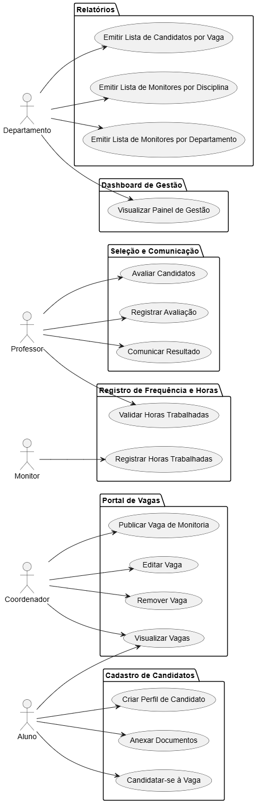

## Casos de Uso

### Descrição:

- Portal de Vagas
    - Publicar Vaga de Monitoria
    - Editar Vaga
    - Remover Vaga
    - Visual

### Atores:

- Coordenador
- Aluno
- Professor
- Monitor
- Departamento

---

## Diagrama UML

