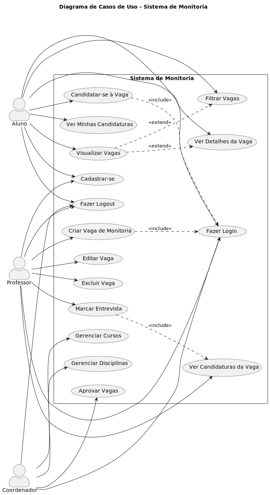

# Diagrama de Casos de Uso

Este diagrama representa os principais casos de uso do sistema de monitoria, baseado na implementação atual do backend Django.



## Atores

- **Aluno**: Estudante que busca vagas de monitoria e se candidata
- **Professor**: Docente que cria e gerencia vagas de monitoria em suas disciplinas
- **Coordenador**: Administrador que gerencia cursos, disciplinas e aprova vagas

## Casos de Uso Implementados

### Autenticação (Todos os Atores)
- **UC01 - Cadastrar-se**: Usuário cria conta no sistema (aluno ou professor)
- **UC02 - Fazer Login**: Usuário autentica-se com email institucional e senha
- **UC03 - Fazer Logout**: Usuário encerra a sessão

### Aluno
- **UC04 - Visualizar Vagas**: Aluno visualiza vagas abertas do seu curso
- **UC05 - Filtrar Vagas**: Aluno filtra vagas por nome, período ou tipo (Monitoria/TA)
- **UC06 - Ver Detalhes da Vaga**: Aluno acessa informações completas da vaga
- **UC07 - Candidatar-se à Vaga**: Aluno se candidata a uma vaga de monitoria
- **UC08 - Ver Minhas Candidaturas**: Aluno acompanha suas candidaturas

### Professor
- **UC09 - Criar Vaga de Monitoria**: Professor cria nova vaga para suas disciplinas
- **UC10 - Editar Vaga**: Professor altera dados de uma vaga (descrição, status, etc.)
- **UC11 - Excluir Vaga**: Professor remove uma vaga que criou
- **UC12 - Ver Candidaturas da Vaga**: Professor visualiza alunos candidatos
- **UC13 - Marcar Entrevista**: Professor agenda entrevista com candidatos

### Coordenador
- **UC14 - Gerenciar Cursos**: Coordenador administra cursos
- **UC15 - Gerenciar Disciplinas**: Coordenador administra disciplinas
- **UC16 - Aprovar Vagas**: Coordenador aprova vagas criadas por professores

## Relacionamentos

- **<<include>>**: UC07 (Candidatar-se) e UC09 (Criar Vaga) incluem UC02 (Login) - usuário precisa estar autenticado
- **<<extend>>**: UC04 (Visualizar Vagas) pode ser estendido por UC05 (Filtrar) e UC06 (Ver Detalhes)

---

**Nota**: Para atualizar o diagrama, edite o arquivo `.puml` e regenere o SVG:
```bash
plantuml -tsvg docs/Elaboracao/plantuml-project/diagrams/casos_de_uso.puml
```