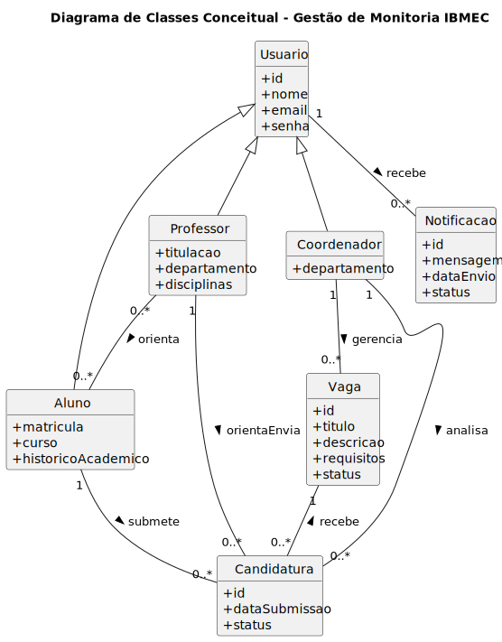

# Diagrama de Classes (Conceitual Limpo)

Para apresentação e entendimento do domínio, esta versão foca na clareza do negócio, reduzindo detalhes técnicos do Django:



Principais ideias refletem o projeto atual:
- Usuario como base, com papéis Aluno, Professor e Coordenador (herança conceitual)
- Curso oferece Disciplinas, que são ministradas por Professores
- Disciplinas abrem Vagas de Monitoria; Alunos submetem Candidaturas a Vagas
- Histórico do Aluno por Disciplina com CR
- Coordenadores coordenam Cursos

Notas:
- O diagrama é conceitual e privilegia entendimento. O modelo lógico no código usa OneToOne para perfis (Aluno/Professor/Coordenador) e um M:N entre Curso e Coordenador.
- Mesmo nome de Disciplina pode existir com professores ou cursos diferentes.

Como atualizar o desenho (se editar o `.puml`):
```bash
plantuml -tsvg docs/Elaboracao/plantuml-project/diagrams/diagrama_classes_conceitual.puml
mkdocs build  # opcional
```