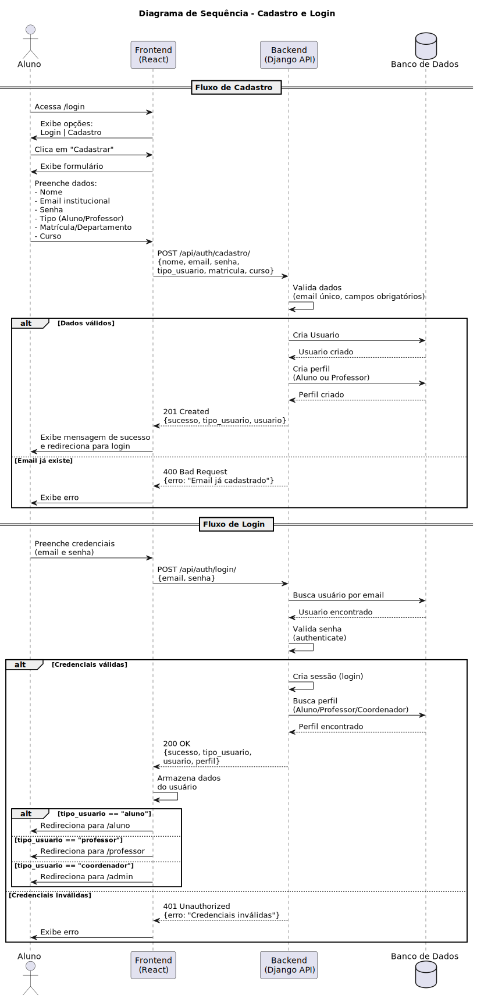
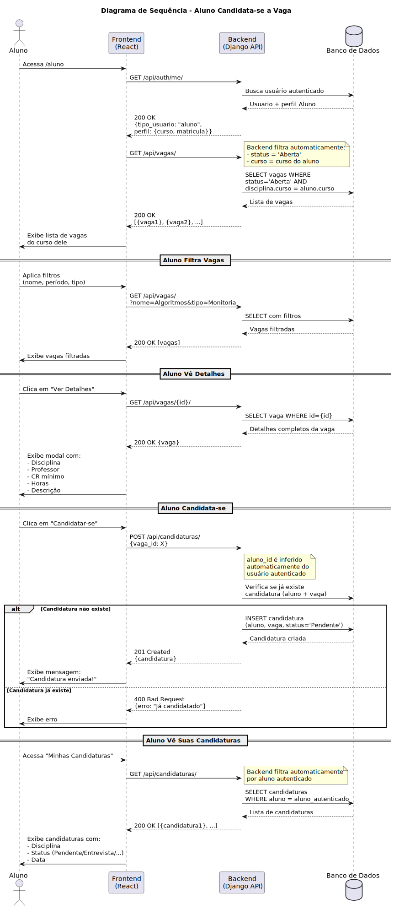
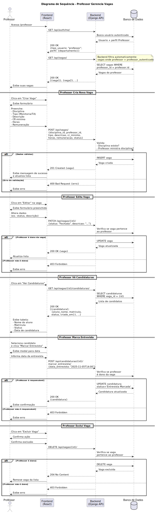

# Diagramas de Sequência

Os diagramas de sequência ilustram os principais fluxos de interação entre usuários, frontend e backend do sistema de monitoria.

## 1. Cadastro e Login



### Descrição
Este diagrama mostra o fluxo completo desde o cadastro de um novo usuário até o login e redirecionamento baseado no tipo de perfil (Aluno/Professor/Coordenador).

**Atores:**
- Aluno (ou Professor)
- Frontend React
- Backend Django API
- Banco de Dados

**Principais Etapas:**
1. Usuário acessa `/login` e escolhe cadastrar-se
2. Preenche formulário com dados pessoais e tipo de usuário
3. Backend valida dados e cria Usuario + perfil correspondente
4. Após cadastro, usuário faz login
5. Sistema autentica, cria sessão e retorna tipo de usuário
6. Frontend redireciona para dashboard correspondente (/aluno, /professor ou /admin)

---

## 2. Aluno Candidata-se a Vaga



### Descrição
Fluxo de um aluno visualizando vagas do seu curso, aplicando filtros, vendo detalhes e candidatando-se a uma vaga.

**Principais Etapas:**
1. Aluno acessa `/aluno`
2. Sistema carrega vagas abertas automaticamente filtradas por curso do aluno
3. Aluno pode aplicar filtros adicionais (nome, período, tipo)
4. Aluno visualiza detalhes de uma vaga
5. Aluno se candidata (sistema associa automaticamente ao aluno autenticado)
6. Sistema verifica duplicidade e cria candidatura
7. Aluno pode visualizar suas candidaturas em andamento

**Filtros Inteligentes:**
- Backend retorna apenas vagas abertas do curso do aluno
- `aluno_id` é inferido automaticamente na criação da candidatura

---

## 3. Professor Gerencia Vagas



### Descrição
Fluxo completo de um professor gerenciando vagas de monitoria: criar, editar, visualizar candidaturas, marcar entrevistas e excluir vagas.

**Principais Etapas:**

### Criar Vaga
1. Professor acessa `/professor`
2. Sistema carrega apenas vagas que ele criou
3. Professor clica em "Criar Vaga"
4. Preenche: disciplina, tipo, descrição, CR mínimo, horas, remuneração
5. Sistema valida e cria vaga

### Editar Vaga
1. Professor clica em "Editar" em uma vaga existente
2. Altera dados (ex.: status, descrição)
3. Sistema verifica permissão (professor deve ser dono da vaga)
4. Atualiza vaga

### Ver Candidaturas
1. Professor clica em "Ver Candidaturas"
2. Sistema lista candidatos com nome, matrícula, status e data

### Marcar Entrevista
1. Professor seleciona candidato
2. Informa data da entrevista
3. Sistema atualiza status da candidatura para "Entrevista Marcada"

### Excluir Vaga
1. Professor confirma exclusão
2. Sistema verifica permissão e remove vaga

**Segurança:**
- Apenas professor dono da vaga pode editar ou excluir
- Apenas professor responsável pela vaga pode marcar entrevistas

---

## Tecnologias

- **Frontend**: React + Vite
- **Backend**: Django 5.2 + Django REST Framework
- **Autenticação**: SessionAuthentication (cookie-based)
- **Banco de Dados**: SQLite (dev) / PostgreSQL (produção recomendado)

---

**Nota**: Para regenerar os diagramas SVG:
```bash
plantuml -tsvg docs/Elaboracao/plantuml-project/diagrams/sequencia_*.puml
```
