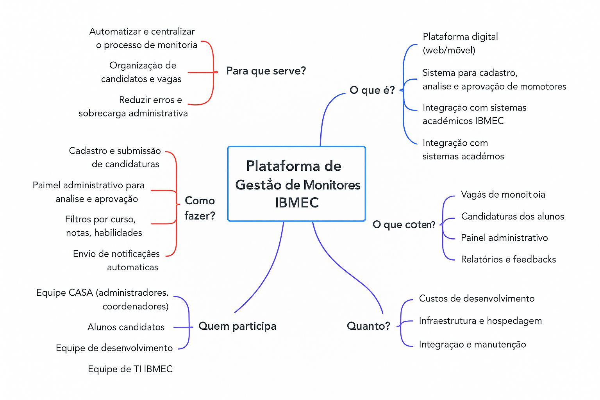

# Plataforma de Gestão de Monitoria IBMEC

## Objetivo
- Automatizar e centralizar o processo de seleção de monitoria
- Reduzir erros e sobrecarga do setor CASA
- Melhorar transparência e comunicação

## Usuários
- Coordenador (CASA)
- Aluno (Candidato)
- Professor
- Monitor
- Departamento
- Equipe de TI

## Funcionalidades Principais
- Cadastro de usuários (alunos, coordenadores)
- Publicar/Editar/Remover vagas de monitoria
- Submissão de candidaturas
- Análise, aprovação e rejeição de candidaturas
- Filtros e seleção rápida de candidatos
- Geração de relatórios dinâmicos
- Envio de notificações automáticas
- Comunicação entre candidatos e equipe CASA
- Integração com sistema acadêmico

## Problemas Resolvidos
- Processo manual e descentralizado
- Sobrecarga administrativa
- Demora e erros na seleção
- Falta de transparência para alunos

## Restrições
- Foco apenas na análise e gestão das candidaturas
- Não inclui agendamento de sessões ou avaliação de desempenho dos monitores

## Tecnologias/Integrações
- Plataforma web (desktop e mobile)
- Integração com sistema acadêmico IBMEC

## Etapas do Projeto (5W2H)
- Curto prazo: MVP e testes iniciais
- Médio prazo: Implantação piloto
- Longo prazo: Expansão para todas as monitorias

---

